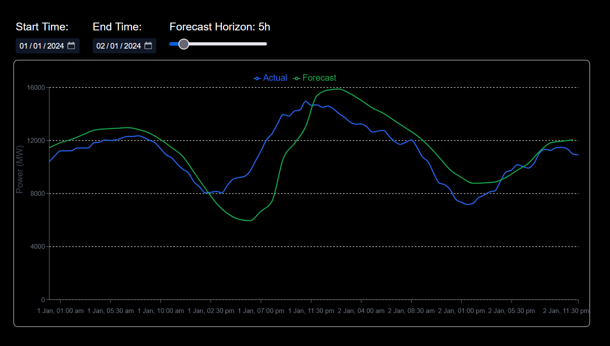

This project consists of a full-stack forecast monitoring application and a comprehensive data analysis of the Elexon wind power generation dataset.

##AI Usage
I utilized AI assistance (Gemini) during the development of the web application. Specifically, AI was used for:
1. Debugging React rendering issues (specifically configuring Recharts to handle missing 30-minute intervals using `connectNulls`).
2. Assisting with the timezone conversion logic (UTC to IST) on the frontend.

*Note - The data analysis, logic formulation, and percentile reasoning in the Jupyter Notebooks were completed from first principles, with AI only used for low-level Pandas syntax checks.*

## How to Start the Application Locally

### 1. Start the Backend (Spring Boot)
The backend acts as a "Backend-For-Frontend" (BFF), fetching, filtering, and merging the Elexon actuals and forecast data.
1. Navigate to the backend directory: `cd wind-backend`
2. Ensure you have Java 17+ and Maven installed.
3. Run the application: `mvn spring-boot:run`
4. The API will be available at `http://localhost:8080/api/wind-data`.

### 2. Start the Frontend (Next.js)
The frontend provides the interactive UI to visualize the data.
1. Navigate to the frontend directory: `cd wind-frontend`
2. Install the dependencies: `npm install`
3. Start the development server: `npm run dev`
4. Open your browser and navigate to `http://localhost:3000`.

### 3. View the Data Analysis
1. Navigate to the analysis directory: `cd analysis`
2. Launch Jupyter Notebook: `jupyter notebook`
3. Open `Wind_power_analysis.ipynb` to view the step-by-step breakdown of forecast errors and the wind power reliability recommendation.